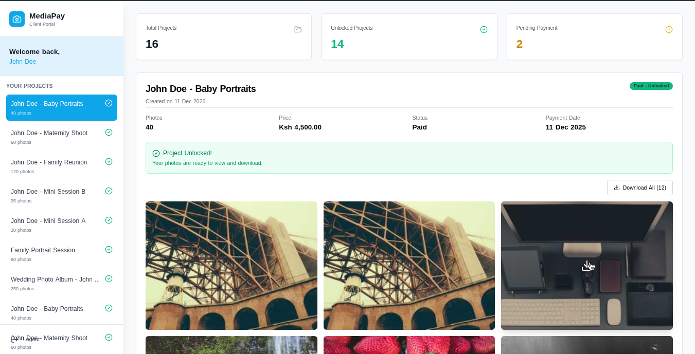
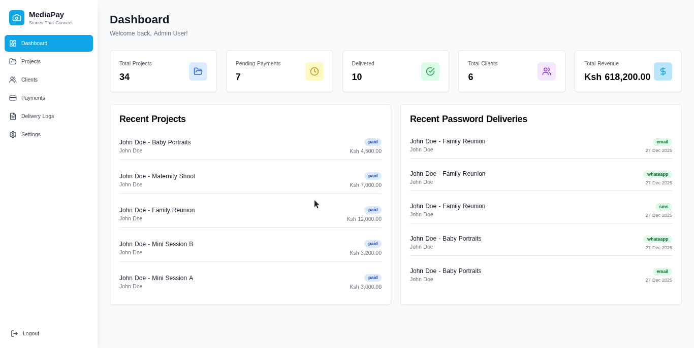

# MediaPay - Automated Password Delivery System


## Overview

A complete demo web application for **MediaPay** ("Stories That Connect") that automates password delivery to clients after payment confirmation. This system eliminates manual password management and ensures instant, reliable delivery through multiple channels.





##  Key Features

### Authentication & Security
-  Secure admin login with NextAuth.js
-  Protected dashboard routes with middleware
- Auto-generated 12-character secure passwords using nanoid
-  Demo credentials: `admin@kingkidd.com` / `demo123`

### Project Management
-  Create and manage photography projects
-  Assign projects to clients
-  Auto-generate secure passwords for content links
-  Track project status (Pending → Paid → Delivered)

### Client Management
-  Add and manage client information
-  Store email, phone, and WhatsApp contacts
-  View client project history

### Payment Tracking (Simulated)
-  Simulate payments via M-Pesa, PayPal, and Bank Transfer
-  One-click payment confirmation
-  Real-time status updates

### Automated Password Delivery (Simulated)
-  **Automatic** password delivery on payment confirmation
-  Multi-channel delivery (Email, SMS, WhatsApp)
-  Instant delivery simulation
-  Complete delivery logs and tracking

### Dashboard & Analytics
-  Overview statistics
-  Recent activity feed
-  Payment tracking
-  Delivery logs with filtering

##  Quick Start

### Prerequisites
- Node.js 18+ installed
- npm or yarn package manager

### Installation

1. Clone the repository:
```bash
git clone https://github.com/ianmuriuki/media.git
cd media
```

2. Install dependencies:
```bash
npm install
```

3. Set up the database:
```bash
npm run db:push
npm run db:seed
```

4. Start the development server:
```bash
npm run dev
```

5. Open your browser and navigate to:
```
http://localhost:3000
```

6. Login with demo credentials:
- **Email:** admin@kingkidd.com
- **Password:** demo123

##  Project Structure

```
/
├── app/
│   ├── (auth)/
│   │   └── login/              # Login page
│   ├── (dashboard)/
│   │   ├── dashboard/          # Main dashboard
│   │   ├── projects/           # Project management
│   │   ├── clients/            # Client management
│   │   ├── payments/           # Payment tracking & simulation
│   │   ├── logs/               # Delivery logs
│   │   └── settings/           # System settings
│   └── api/
│       ├── auth/               # NextAuth API routes
│       ├── projects/           # Project CRUD endpoints
│       ├── clients/            # Client CRUD endpoints
│       └── simulate/           # Payment simulation
├── components/
│   ├── ui/                     # Reusable UI components
│   └── dashboard/              # Dashboard-specific components
├── lib/
│   ├── prisma.ts              # Prisma client
│   ├── auth.ts                # NextAuth configuration
│   └── utils.ts               # Utility functions
├── prisma/
│   ├── schema.prisma          # Database schema
│   └── seed.ts                # Seed data script
└── styles/
    └── globals.css            # Global styles
```

##  Tech Stack

- **Frontend:** Next.js 14+ with App Router, React 18, TypeScript
- **Styling:** Tailwind CSS with custom color scheme
- **Authentication:** NextAuth.js with credentials provider
- **Database:** SQLite with Prisma ORM
- **State Management:** React hooks + Context API
- **Notifications:** React Hot Toast
- **Icons:** Lucide React

##  Color Scheme

- **Primary:** Sky Blue (#0EA5E9) - Main brand color
- **Secondary:** White (#FFFFFF) - Clean background
- **Accent:** Green (#10B981) - Success states
- **Warning:** Yellow - Demo mode indicators
- **Danger:** Red - Delete actions

##  Database Schema

### Models
- **User:** Admin authentication
- **Client:** Customer information
- **Project:** Photography projects with content links
- **Payment:** Payment tracking records
- **DeliveryLog:** Password delivery history

##  Workflow

### Current Manual Process (Before)
1. Share content link with client
2. Wait for client to clear balance
3. Manually send password once payment confirmed

### Automated Process (After)
1. Create project and assign to client
2. Client makes payment
3. **System automatically:**
   - Confirms payment
   - Updates project status
   - Generates delivery logs
   - Sends password via Email, SMS, and WhatsApp
   - Marks project as delivered

##  Demo Mode

This is a **DEMONSTRATION** application. All payment processing and message delivery are **SIMULATED**:

-  Payment buttons simulate instant payment confirmation
-  Delivery notifications show simulated Email/SMS/WhatsApp sends
-  No real money is processed
-  No real messages are sent

### For Production Use
To use in production, integrate:
- **Payment Gateways:** M-Pesa API, PayPal SDK, Stripe
- **Email Service:** SendGrid, AWS SES, Mailgun
- **SMS Service:** Twilio, Africa's Talking
- **WhatsApp:** WhatsApp Business API

##  Sample Data

The seed script includes:
- 1 admin user
- 5 sample clients
- 8 sample projects (various statuses)
- 5 completed payments
- Multiple delivery logs

##  Development

### Available Scripts

```bash
npm run dev          # Start development server
npm run build        # Build for production
npm run start        # Start production server
npm run lint         # Run ESLint
npm run db:push      # Push schema to database
npm run db:seed      # Seed database with demo data
```

### Environment Variables

Create a `.env` file (optional, has defaults):

```env
NEXTAUTH_SECRET=your-secret-key-here
NEXTAUTH_URL=http://localhost:3000
```

##  Key Features Demonstrated

### Problem Solved
-  **Before:** Manual password delivery, delays, human error, scalability issues
-  **After:** Instant automated delivery, no human intervention, 100% reliable, infinitely scalable

### Automation Benefits
- **Instant Delivery:** No waiting for manual intervention
- **Multi-Channel:** Email, SMS, and WhatsApp simultaneously
- **Reliable:** Automated logging and tracking
- **Scalable:** Handle unlimited projects
- **Professional:** Consistent, timely communication


##  Deployment

### Vercel (Recommended)

1. Push to GitHub
2. Import project in Vercel
3. Deploy automatically

### Other Platforms

Build the application:
```bash
npm run build
```

Start production server:
```bash
npm start
```

##  Security Notes

- Passwords are hashed with bcrypt
- Session management via JWT
- Protected API routes
- SQL injection prevention via Prisma
- Input validation on all forms


##  Contact


---

**Note:** This is a demonstration system. All payments and messaging are simulated. For production use, integrate with real payment gateways and messaging services.
